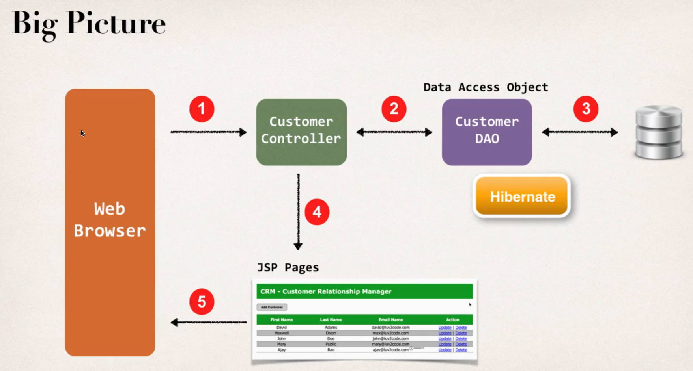

## Customer Data Access Object

- Responsible for interfacing with the database

- This is a common design pattern : **Data Access Object (DAO)**

  


## Customer Dara Access Object

- For Hibernate our DAO needs a Hibernate SessionFactory


## Hibernate Session Factory

- Hibernate SessionFactory needs a Data Source

  - The data source defines database connection info

    

**Data Source :**  Data Source tells us hot to connect with database

```xml
  <!-- Step 1: Define Database DataSource / connection pool -->
	<bean id="myDataSource" class="com.mchange.v2.c3p0.ComboPooledDataSource"
          destroy-method="close">
        <property name="driverClass" value="com.mysql.cj.jdbc.Driver" />
        <property name="jdbcUrl" value="jdbc:mysql://localhost:3306/web_customer_tracker?useSSL=false&amp;serverTimezone=UTC" />
        <property name="user" value="hbstudent" />
        <property name="password" value="hbstudent" /> 

        <!-- these are connection pool properties for C3P0 -->
        <property name="minPoolSize" value="5" />
        <property name="maxPoolSize" value="20" />
        <property name="maxIdleTime" value="30000" />
	</bean>  
```

**Session Factory:** actually depends on data source

```xml
 <!-- Step 2: Setup Hibernate session factory -->
	<bean id="sessionFactory"
		class="org.springframework.orm.hibernate5.LocalSessionFactoryBean">
		<property name="dataSource" ref="myDataSource" />
		<property name="packagesToScan" value="com.touhid.springdemo.entity" />
		<property name="hibernateProperties">
		   <props>
		      <prop key="hibernate.dialect">org.hibernate.dialect.MySQLDialect</prop>
		      <prop key="hibernate.show_sql">true</prop>
		   </props>
		</property>
   </bean>	  
```


# Spring @Transactional

- automatically begin and end transaction for hibernate code
- no need for to do this in code

```java
@Transactional
public List<Customer> getCustomer() {
    // get the current hibernate4 session
    Session currentSession = sessionFactory.getCurrentSession();
    
    // create quyery
    Query<Customer> theQuery = currentSession.createQuery("from customer". Customer.class);
    
    //get the result list
    List<Customer> customers = theQuery.getResultList();
    return customers;
}
```


### 	Specialized Annotations for DAOs

- Applied to DAO implementations
- Spring will automatically register the DAO implementations 
- Spring also provides translations of any JDBC related exception

```java
@Repository
public class CustomerDAOImpl implements CustomerDAO {
	
    @Autowired
    private SessionFactory sessionFactory;
    
    @Transactional
    public List<Customer> getCustomers() {
        ... 
    }
}
```

```java
package com.luv2code.springdemo.dao;
import java.util.List;
import com.luv2code.springdemo.entity.Customer;

public interface CustomerDAO {
	public List<Customer> getCustomers();	
}
```


# Add bootstrap manually in /resources folder

```xml
	<!-- add bootstrap manually in resourses folder -->
	<mvc:resources location="/resources/" mapping="/resources/**"></mvc:resources>
```

### In jsp file add this bootstrap location

```jsp
<head>
	<title>List Customers</title>
	<!-- reference our style sheet -->
	<link type="text/css"
		  rel="stylesheet"
		  href="${pageContext.request.contextPath}/resources/css/style.css" />
</head>
```


# Constraint the Request Mapping - Get and Post 

```java
@RequestMapping(path="/processFormGet" , method="RequestMehtod.GET")
public String processFormGet( ) {

}
@RequestMapping(path="/processFormPost" , method="RequestMehtod.POST")
public String processFormPost( ) {

}
```

- The mapping Only handles GET method
- Any other HTTP REQUEST method will get rejected

## New Annotation Short-Cut

**@GetMapping("")** and **@PostMapping("")**

```JAVA
@GerMapping("/processFormGet")
public String processFormGet(....) {
	.....			
}

@GerMapping("/processFormPost")
public String processFormPost(....) {
	.....			
}
```


# Specialized Annotation for Service


#### Add a Service Layer

> Customer Controller <------> Customer Service <------> Customer DAO <------> DB


##### @Service Annotation

- @Service will automatically register the Service implementation - thanks to component scanning. 

For example :

**Customer Service:**

1. Define Service Interface
2. Define Service Implementation
   1. Inject the CustomerDAO


# Add a Customer  

Annotation Lists: 

- @Autowired
- **In Controller :**  @RequestMapping("")   ||  @GetMapping("/")   ||  @PostMapping("/")
- **In Service:** @Service  ||  @Transactional
- **In DAO:** @Repository
- **In Model:** @Entity ||   @Table(name = "")  ||  @Id @GeneratedValue(strategy = GenerationType.IDENTITY)  ||  @Column(name = "id")

Todo: 

1. Update list-customer.jsp (add new button [ Add Customer] )

2. Create HTML form for new customer

3. Process Form Data

   1. Controller -> Service -> DAO

      > in controller to create a model attribute to bind form data

   > Add form tag lib
   >
   > ```jsp
   > <%@ taglib prefix="form" uri="http://www.springframework.org/tags/form" %>  
   > ```

   

   > Controller

   > ****
   >
   > CustomerController.java
   >
   > ```java
   > Controller
   > @RequestMapping("/customer")
   > public class CustomerController {
   > 	
   > 	// inject the dao - customer service  
   > 	@Autowired
   > 	private CustomerService customerService;
   > 	
   > 	@GetMapping("/list")
   > 	public String listCustomer(Model model) {
   > 		
   > 		// get customers from the service
   > 		List<Customer> theCustomers = customerService.getCustomers();
   > 		
   > 		// add the customers to the model
   > 		model.addAttribute("customers", theCustomers);
   > 		
   > 		return "list-customer";
   > 	}
   > 	
   > 	@GetMapping("/new-customer")
   > 	public String newCustomerPage(Model model) {
   > 		Customer theCustomer = new Customer();
   > 		model.addAttribute("customer" , theCustomer);
   > 		return "add-customer";
   > 	}
   > 	
   > 	@PostMapping("/add-customer")
   > 	public String addCustomer(@ModelAttribute("customer") Customer customer, BindingResult result ) {
   > 		if(result.hasErrors()) {
   > 			return "add-customer";
   > 		} 
   > 		customerService.saveCustomer(customer);
   > 		return "redirect:/customer/list";
   > 	}
   > }
   > ```
   >
   > ****

   

   > Service

   > ****
   >
   > CustomerService .java
   >
   > ```java
   > public interface CustomerService {
   > 	
   > 	public List<Customer> getCustomers() ;
   > 
   > 	public void saveCustomer(Customer customer);
   > }
   > ```
   >
   > 
   >
   > CustomerService.java
   >
   > ```java
   > @Service
   > public class CustomerServiceImpl implements CustomerService {
   > 
   > 	@Autowired
   > 	private CustomerDAO customerDAO;
   > 	
   > 	@Override
   > 	@Transactional
   > 	public List<Customer> getCustomers() {
   > 		return customerDAO.getCustomers();
   > 	}
   > 
   > 	@Override
   > 	@Transactional
   > 	public void   saveCustomer(Customer customer) {
   > 		customerDAO.saveCustomer(customer);
   > 		
   > 	}
   > }
   > ```
   >
   > ****

   

   > DAO

   > ****
   >
   > CustomerDAO.java
   >
   > ```java
   > public interface CustomerDAO {
   > 	
   > 	public List<Customer> getCustomers();
   > 
   > 	public void saveCustomer(Customer customer);
   > 	
   > }
   > ```
   >
   > CustomerDAO.java
   >
   > ```java
   > @Repository
   > public class CustomerDAOImpl implements CustomerDAO {
   > 
   > 	//need to inject the session factory
   > 	@Autowired
   > 	private SessionFactory sessionFactory;
   > 	
   > 	@Override
   > 	public List<Customer> getCustomers() {
   > 		
   > 		// get current session
   > 		Session currentSession = sessionFactory.getCurrentSession();
   > 		
   > 		// create a query
   > 		Query<Customer> theQuery = currentSession.createQuery("from Customer order by firstName", Customer.class);	
   > 		
   > 		// execute the query and get result
   > 		List<Customer> customers = theQuery.getResultList();
   > 		return customers;
   > 	}
   > 
   > 	@Override
   > 	public void saveCustomer(Customer customer) {
   > 	
   > 		Session currentSession = sessionFactory.getCurrentSession();
   > 		currentSession.save(customer);
   > 		
   > 	}
   > }
   > ```
   >
   > ****

   

   > Entity

   > ****
   >
   > Customer.java
   >
   > ```java
   > @Entity
   > @Table(name = "customer")
   > public class Customer {
   > 
   > 	@Id
   > 	@GeneratedValue(strategy = GenerationType.IDENTITY)
   > 	@Column(name = "id")
   > 	private int id;
   > 
   > 	@Column(name = "first_name")
   > 	private String firstName;
   > 
   > 	@Column(name = "last_name")
   > 	private String lastName;
   > 
   > 	@Column(name = "email")
   > 	private String email;
   > 	
   > 	public Customer() {}
   > 
   > 	// getters setters
   > 	
   > 	@Override
   > 	public String toString() {
   > 		return "Customer [id=" + id + ", firstName=" + firstName + ", lastName=" + lastName + ", email=" + email + "]";
   > 	}	
   > }
   > ```
   >
   > ****
   >
   
   
   
# Update Customer 
   
> **list-customer.jsp**
   >
   > ```jsp
   > <c:url var="updateLink" value="">
   > 	<c:param name="customerId" value="${customer.id }" />
   > </c:url>
   > 
   > <tr>
   > 	<td>${customer.firstName}</td>
   > 	<td>${customer.lastName}</td>
   > 	<td>${customer.email}</td>
   > 	
   >    	<td><a href="${updateLink}" class="btn btn-primary mr-1">Update</a></td>
   > </tr>
   > ```
   
   
   
   ## Remember: 
   
   - When FORM is **SUBMITTED** Spring MVC will call **SETTER Methods** 
   - When FORM is **LOADED**  Spring MVC will call **GETTER Methods**
   
   ### saveOrUpdate():
   
   ```java
   // currentSession.saveOr(customer);
      currentSession.saveOrUpdate(customer);
   ```
   
   
   
   
   
   
   
   # Delete Customer
   
   > **list-customer.jsp** 
   
   ```jsp
   <c:url var="deleteLink" value="deleteCustomer">
   	<c:param name="customerId" value="${customer.id }" />
   </c:url>
   
   <tr>
   	<td>${customer.firstName}</td>
   	<td>${customer.lastName}</td>
   	<td>${customer.email}</td>
   	<td>
           <a href="${updateLink}" class="btn btn-primary mr-1">Update</a>
   		| <a href="deleteLink" class="btn btn-danger">Delete</a>
       </td>
   </tr>
   ```
   
   > CustomerController.java
   >
   > ```java
   >@GetMapping("/deleteCustomer")
   > public String deleteCustomer(@RequestParam("customerId") int id, Model model) {
   > 	customerService.deleteCustomer(id);
   > 	return "redirect:/list-customer";
   > }
   > ```
   > 
   > CustomerServiceImpl.java
   > 
   > ```java
   > @Override
   > @Transactional
   > public void deleteCustomer(int id) {
   > 	customerDAO.deleteCustomer(id);
   > }
   > ```
   > 
   > CustomerDAOImpl.java
   > 
   > ```java
   > @Override
   > public void deleteCustomer(int id) {
   > 	Session currentSession = sessionFactory.getCurrentSession();
   > 	Query theQuery = currentSession.createQuery("delete from Customer where id=:customerId", Customer.class);
   > 	theQuery.setParameter("customerId", id);
   > 	theQuery.executeUpdate();
   > }
   > ```
   > 
   > ****
   
   
   
   
   
   

